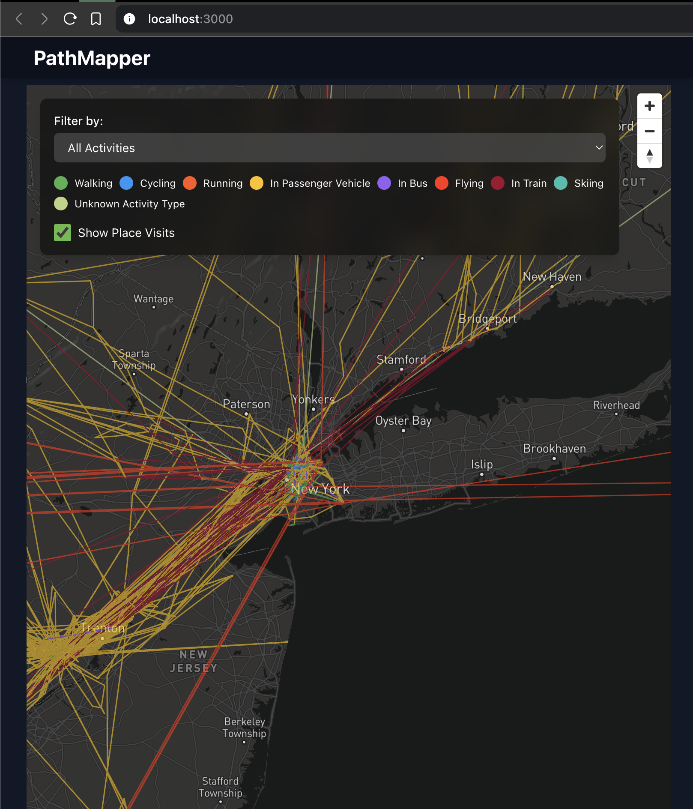

# PathMapper

PathMapper is a React app to visualizes your Google Takeout location history data on an interactive map. It allows you to explore your movements, filter by activity types, and view detailed information about your trips and place visits.



## Features

- 🗺️ Interactive map visualization of location history
- 🚶‍♂️🚴‍♀️🚗 Activity-based route filtering (walking, cycling, driving, etc.)
- 📍 Place visit markers with detailed information
- 🎨 Color-coded routes based on activity type
- 📊 Trip details including start time, end time, and duration
- 🔍 Zoom and pan controls for easy navigation

## Tech Stack

- Frontend: React
- Map Rendering: Mapbox GL JS
- Styling: Tailwind CSS
- Backend: Node.js with Express
- Data Processing: Custom JavaScript utilities

## Prerequisites

Before you begin, ensure you have met the following requirements:

- Node.js (v14 or later)
- npm (v6 or later)
- A Mapbox API key

## Installation

1. Clone the repository:
   ```
   git clone https://github.com/your-username/pathmapper.git
   cd pathmapper
   ```

2. Install dependencies:
   ```
   npm install
   ```

3. Create a `.env` file in the root directory and add your Mapbox API key:
   ```
   REACT_APP_MAPBOX_ACCESS_TOKEN=your_mapbox_api_key_here
   ```

4. Start the development server:
   ```
   npm run dev
   ```

This will start both the React frontend and the Node.js backend concurrently.

## Usage

1. Place your location history JSON files in the `public/location_history` directory. Direct from the google takeout these will be sorted into folders based on the year. Keep that structure in the new `location_history` folder
2. Open your browser and navigate to `http://localhost:3000`.
3. The map will automatically load and display your location data.
4. Use the filter controls to show/hide specific activity types or place visits.
5. Click on routes or place visit markers for more detailed information.

## Contributing

Contributions to PathMapper are welcome! Please follow these steps:

1. Fork the repository
2. Create a new branch: `git checkout -b feature/your-feature-name`
3. Make your changes and commit them: `git commit -m 'Add some feature'`
4. Push to the branch: `git push origin feature/your-feature-name`
5. Submit a pull request

## License

This project is licensed under the MIT License - see the [LICENSE](LICENSE) file for details.

## Acknowledgements

- [Mapbox GL JS](https://docs.mapbox.com/mapbox-gl-js/) for map rendering
- [React](https://reactjs.org/) for building the user interface
- [Tailwind CSS](https://tailwindcss.com/) for styling
- [Express](https://expressjs.com/) for the backend server

## Contact

If you have any questions or feedback, please open an issue on the GitHub repository.

Happy mapping!
